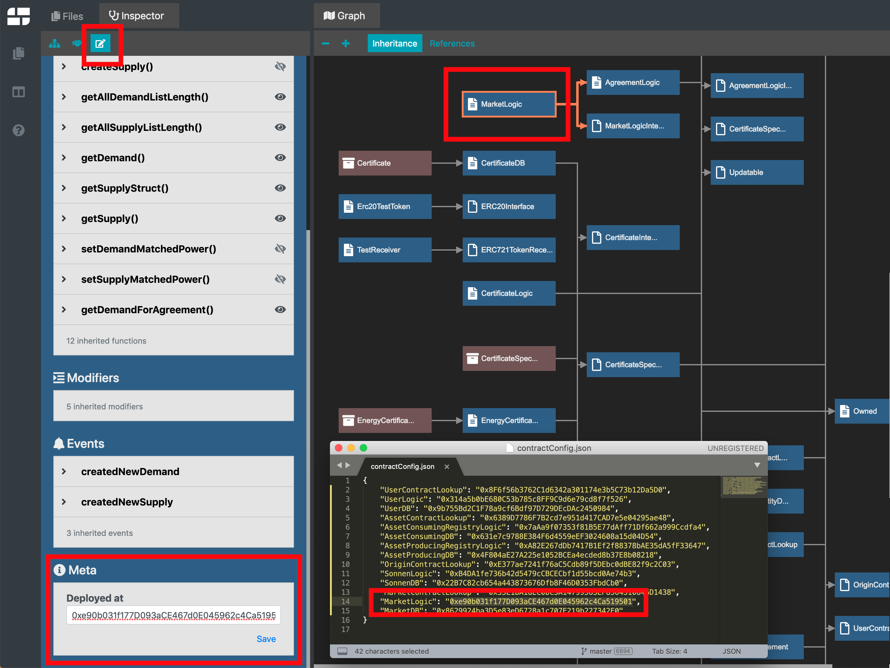
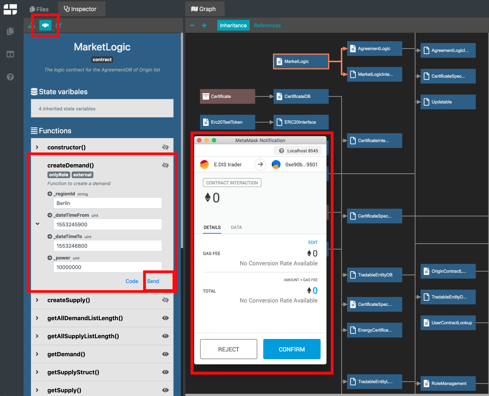
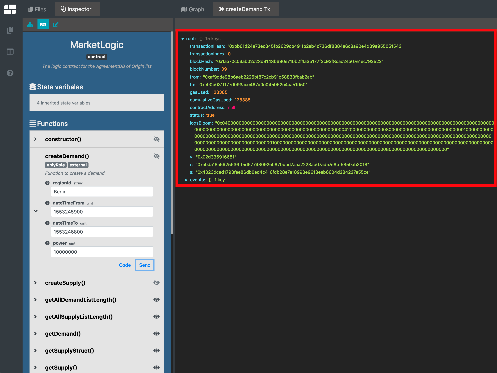

## To run the pilot you will need:

* Backend pilot repository (this repository)
* [Frontend pilot repository](https://github.com/energywebfoundation/sonnen-edis-poc-ui/)
* [Npm](https://www.npmjs.com) installed
* [MetaMask](https://metamask.io) installed

# Run the simulation
To run the simulation locally on your computer you need to:

1. Download and build front and backend repository
2. Start the blockchain 
3. Start the backend 
4. Run the test script
5. Run the UI
6. Open UI in the browser

## Download and build front and backend repository
1. Download the backend and frontend repository from the GitHub. You should have two folders, `sonnen-edis-poc-lib` (backend) and `sonnen-edis-poc-ui` (frontend)
2. Navigate to each folder and run the `npm install` command. If you're pulling newer versions of the code remember to run `npm run build`. 

## Start the blockchain 

1. Open `sonnen-edis-poc-lib` folder in your terminal
2. Run `npm run start-ganache`

## Start the backend

1. Open `sonnen-edis-poc-lib` folder in your terminal
2. Run `npm run start-test-backend`

## Run the test script

1. Open `sonnen-edis-poc-lib` folder in your terminal
2. Run `npm run onBoardTestAsset`
3. This will run a script `asset.js` found in `dist/js/src/asset.js`
4. Script deploys all needed smart contracts to the local blockchain. All addresses of smart contracts are logged under `config/contractConfig.json`
5. Scrip adds assets, sets supply and demand, reports flexibility, and confirms it 

## Run the UI

1. Open `sonnen-edis-poc-ui` folder in your terminal
2. Run `npm start`

## Open UI in the browser

1. Navigate to `sonnen-edis-poc-lib/config/contractConfig.json`
2. Copy the address under the key `OriginContractLookup`
3. In the browser open http://localhost:3000/OriginContractLookup (where `OriginContractLookup` is substituted with an address (e.g. http://localhost:3000/0xE377ae7241f76aC5Cdb89f5DEbc0dBE82f9c2C03))
4. Change MetaMask's network from "Main Ethereum Network" to "Localhost 8545"

# Interact with smart contracts
To interact with smart contracts we're going to use Piet and MetaMask. The easiest way to configure Piet is to pass it to set:

* `gitHubRepo` to "energywebfoundation%2Fsonnen-edis-poc-lib"
* `subDir` to "contracts"
* `contractAddress` to the one under OriginContractLookup in sonnen-edis-poc-lib/config/contractConfig.json
At the end URL should look something like this: https://piet.dev.slock.it/?gitHubRepo=energywebfoundation%2Fsonnen-edis-poc-lib&subDir=contracts&contractAddress=0xE377ae7241f76aC5Cdb89f5DEbc0dBE82f9c2C03#

## Understanding Piet and key pilots smart contracts
Piet has a couple of key sections that are important for us to interact with a pilot. Graph section shows a diagram of smart contracts. Selecting one of the contracts reveals Inspector section. Under Inspector we can see contracts variables, functions, and events.

As you can see there are multiple smart contracts, but we need to focus on only a few that are key for this pilot. They are:

1. `MarketLogic` with functions `createDemand()`, `createSupply()`, and `createAgreement()`
2. `SonnenProducingAssetLogic` with function `saveSmartMeterRead()`
3. `EnergyLogic` with functions `getReportedFlexibility()` and `approveCertificate()`

We need to understand that Piet knows the structure of contracts from the GitHub repository. In order for Piet to communicate with a specific smart contract, we need to give it an address of each contract we want to interact with. Here's how we would interact with `createDemand()` function:

1. On disk, open `contractConfig.json` file and copy address under key `MarketLogic`
2. In Piet, navigate to `MarketLogic` contract in Graph section and click on it
3. Enable edit mode by clicking on pencil icon under Inspector 
4. This will enable section "Deployed at" at the bottom of the Inspector
5. Paste the address copied in step 1 and save it
6. Enable interactive mode by clicking on a handshake icon next to the pencil icon
7. Select "createDemand()" section and fill in the needed data 
8. Click "send" button 
9. This will open a MetaMask dialog and we'll need to be signed in as E.DIS trader
10. Transaction can be successful or show error, in both cases UI will display it. Successful transaction shows it's output with full details

Here's a visual representation of the steps above:

## Setting up MetaMask addresses
In order to interact with smart contracts, we need to sign every transaction by the appropriate key. In this tutorial, we'll show public keys publicly. It's extremely important to understand that you should never show your own private keys publicly. Private keys require proper management. The only reason why we're showing it publicly is to help you understand how the pilot works. In a production environment, you should create your own user and assets from your own private keys. So once again, please make sure you do not reveal your own private key publicly. 

Private keys needed for this pilot are:

1. E.DIS trader (sets demand, creates agreement, and approves certificate): `0x2dc5120c26df339dbd9861a0f39a79d87e0638d30fdedc938861beac77bbd3f5`
2. Sonnen asset owner (sets supply): `0xfaab95e72c3ac39f7c060125d9eca3558758bb248d1a4cdc9c1b7fd3f91a4485`
3. Smart meter (reports measured flexibility): `0x554f3c1470e9f66ed2cf1dc260d2f4de77a816af2883679b1dc68c551e8fa5ed`

To import each private key to MetaMask you need to:

1. Go to "My Accounts" (top right icon)
2. Select "Import Account"
3. Select type "Private key"
4. Paste the key and import
5. If you wish, rename your account to something meaningful (hamburger menu → Details → Pencil) 

## Sequence of transactions in order to have the pilot running

1. Create a supply
    * Set `MarketLogic` contract address. Address is in `contractConfig.json` under `MarketLogic` key
    * Function `MarketLogic.createSupply()`
    * Signed in as Sonnen asset
2. Create a demand
    * Function `MarketLogic.createDemand()`
    * Signed in as E.DIS trader
3. Create an agreement
    * Function `MarketLogic.createAgreement()`
    * Signed in as E.DIS trader
    * You can get id's for supply and demand by going to "Events" section under Inspector. Choose "Get" and press play button to see history
4. Save smart meter reading
    * Set `SonnenProducingAssetLogic` contract address. Address is in `contractConfig.json` under `AssetProducingRegistryLogic` key
    * Function `SonnenProducingAssetLogic.saveSmartMeterRead()`
    * Signed in as Smart meter
5. Approve certificate
    * Set `EnergyLogic` contract address. Address is in `contractConfig.json` under `SonnenLogic` key
    * Function `EnergyLogic.getReportedFlexibility()` returns `false` under `_reportConfirmed`
    * Function `EnergyLogic.approveCertificate()`
    * Signed in as E.DIS trader
    * Function EnergyLogic.getReportedFlexibility() returns now true under _reportConfirmed

### Running on Windows

#### Tobalaba
1. Start Docker for Windows
2. `npm run build_dockerContainer`
3. `npm run docker-start-test-backend` (in separate terminal, it will run in the background)
4. `npm run docker-start-demo`

#### Local network
1. In `connection-config.json` change `https://rpc.slock.it/tobalaba` to `http://localhost:8545`
2. Start Docker for Windows
3. `npm run build_dockerContainer`
4. `npm run docker-start-ganache`
5. `npm run docker-start-test-backend` (in separate terminal, it will run in the background)
6. `npm run docker-start-demo`
7. In MetaMask add RPC with `docker-machine ip`, like: `http://192.168.99.100:8545`

After deploying demo for whichever network, copy `OriginContractLookup` address, it will be needed for the frontend.

#### Running frontend
1. Go to `sonnen-edis-poc-ui`
2. If you don't have Python, please run: `npm install -g --production windows-build-tools`
3. `npm install`
4. In `AppContainer.tsx` change `API_BASE_URL`, by replacing `localhost` with result of `docker-machine ip`, so it should look like: `'http://192.168.99.100:3030'`
5. `npm run start`
6. In browser, in MetaMask, select or add Tobalaba RPC, for example: `https://rpc.slock.it/tobalaba`
7. In browser, go to: `http://localhost:3000/ORIGIN_CONTRACT_LOOKUP_ADDRESS` (where address is the one from deployed demo)

Now you should be able to see the results of deployed demo